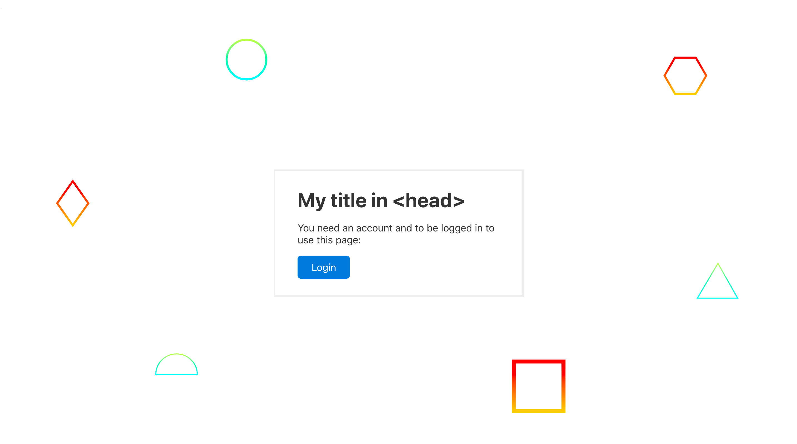

# Standard Portal

A nice drop-in React Login Portal for your projects. It has minimal overhead and it's easy to configure and use in multiple apps. It includes:

- Automatic configuration from environment variables.
- Shows "Login Page" and blocks the App until the user has logged in.
- Top-right default mini profile once logged in for easy session management.
- Refresh token on the background and all other nice Auth0 logic included.
- React Hooks and other API methods and callbacks for customization.

<table>
  <tr>
    <th>
      Portal home page
    </th>
    <th>
      Logged-in profile
    </th>
  </tr>
  <tr>
    <td>
      
    </td>
    <td>
      
    </td>
  </tr>
</table>

Setup [the `.env` variables](#configuration) and then you only need this code for adding a simple portal:

```js
// App.js - The code for the screenshot above:
import Portal from "@standard/portal";

// Just a plain <Auth> wrapper includes a lot of goodies:
export default () => (
  <Portal>
    <div>Your normal App code here...</div>
  </Portal>
);
```

## Getting started

First install this library. You need to install `styled-components` as well if you don't have it yet:

```bash
npm i @standard/portal styled-components
```

Then provide the Auth0 config as environment variables:

```
# Find this in Auth0
REACT_APP_AUTH_CLIENT_ID=
REACT_APP_AUTH_DOMAIN=
REACT_APP_AUTH_AUDIENCE=
```

Finally set it up. Normally just dropping it on your `App.js` it's enough!

```js
// App.js
import Portal from "@standard/portal";

export default () => (
  <Portal>
    <div>Your normal App code here...</div>
  </Portal>
);
```

Finally put an image on your `/portal-background.jpg` to use as the fullscreen background of the portal.

This so far will only provide a plain frontend-only auth. But your data should be locked up behind auth, so you will need to pass the auth token at least to the API. For this you would usually use either the [`<Portal onUser={fn}>...</Portal>`](#portal) callback, or the [`await getToken()`](#await-gettoken) exported function.

## Configuration

The main title will be taken from your page `<title>Hello World</title>` in the `<head />`, so no need to do anything there.

The configuration is automatically read from the **environment variables**:

```
# Required variables from Auth0:
REACT_APP_AUTH_CLIENT_ID=
REACT_APP_AUTH_DOMAIN=
REACT_APP_AUTH_AUDIENCE=

# Optional variables with their defaults:
REACT_APP_AUTH_REDIRECT=/
REACT_APP_AUTH_RESPONSE_TYPE=token id_token
REACT_APP_AUTH_SCOPE=openid profile email
REACT_APP_AUTH_RETURN_TO=/
```

## Styling

You can edit the main screen CSS through the class `.standard-portal`. For example, let's say we want to add a background [from svgbackgrounds.com](https://www.svgbackgrounds.com/):

```
.standard-portal {
  background-color: #ffffff;
  background-image: url("data:image/svg+xml,%3Csvg xmlns='http://www.w3.org/2000/svg' viewBox='0 0 1600 900'%3E%3Cdefs%3E%3ClinearGradient id='a' x1='0' x2='0' y1='1' y2='0'%3E%3Cstop offset='0' stop-color='%230FF'/%3E%3Cstop offset='1' stop-color='%23CF6'/%3E%3C/linearGradient%3E%3ClinearGradient id='b' x1='0' x2='0' y1='0' y2='1'%3E%3Cstop offset='0' stop-color='%23F00'/%3E%3Cstop offset='1' stop-color='%23FC0'/%3E%3C/linearGradient%3E%3C/defs%3E%3Cg fill='%23FFF' fill-opacity='0' stroke-miterlimit='10'%3E%3Cg stroke='url(%23a)' stroke-width='2'%3E%3Cpath transform='translate(0 0)' d='M1409 581 1450.35 511 1490 581z'/%3E%3Ccircle stroke-width='4' transform='rotate(0 800 450)' cx='500' cy='100' r='40'/%3E%3Cpath transform='translate(0 0)' d='M400.86 735.5h-83.73c0-23.12 18.74-41.87 41.87-41.87S400.86 712.38 400.86 735.5z'/%3E%3C/g%3E%3Cg stroke='url(%23b)' stroke-width='4'%3E%3Cpath transform='translate(0 0)' d='M149.8 345.2 118.4 389.8 149.8 434.4 181.2 389.8z'/%3E%3Crect stroke-width='8' transform='rotate(0 1089 759)' x='1039' y='709' width='100' height='100'/%3E%3Cpath transform='rotate(0 1400 132)' d='M1426.8 132.4 1405.7 168.8 1363.7 168.8 1342.7 132.4 1363.7 96 1405.7 96z'/%3E%3C/g%3E%3C/g%3E%3C/svg%3E");
}
```

Similarly, you can style children like:

```css
.standard-portal h1 {
  /* ... */
}

.standard-portal p {
  /* ... */
}

.standard-portal button {
  /* ... */
}
```

## API

The library exposes mainly a default export and some helpers:

```js
import Portal, { useProfile, getToken, logout } from "@standard/portal";
```

- [`<Portal></Portal>`](#portal) is a component that should wrap all of your App.
  - `onUser={fn}`: method that is called when a user logs in.
  - `showProfile={true}`: boolean to show/hide the small top-right profile.
- [`useProfile()`](#useprofile) is a hook that returns the user info: `id`, `name`, `email` and `img`.
- [`getToken()`](#gettoken) is an async method to get the user Auth token
- [`logout()`](#logout) is an async method to log the user out and show the login screen again
- `AuthContext` is an advanced [React Context](https://reactjs.org/docs/context.html) variable that exposes the Provider/Consumer context.

### \<Portal />

Portal is a component that should wrap all of your app, normally it'd live inside `App.js`:

```js
import Portal from "@standard/portal";

export default () => (
  <Portal>
    <div>Your normal App code here...</div>
  </Portal>
);
```

#### \<Portal onUser={fn} />

It exposes an event prop, `onUser`, for whenever a user logs in. This is useful for e.g. attaching the user to Sentry:

```js
import Portal from "@standard/portal";
import * as Sentry from "@sentry/browser";

// Register the user on Sentry
const onUser = ({ name, email }, token) => {
  Sentry.configureScope(function(scope) {
    scope.setUser({ username: name, email });
  });
};

export default () => (
  <Portal onUser={onUser}>
    <div>Your normal App code here...</div>
  </Portal>
);
```

#### \<Portal showProfile={true} />

This is a boolean prop (defaults to TRUE) to tell whether to show a small profile on the top-right of the page on load:


If you don't like the default profile, you can set this prop to false and provide your own:

```js
// App.js
import Portal, { useProfile, logout } from "@standard/portal";

const Greeting = () => {
  const user = useProfile();
  return (
    <div className="MyCustomProfile">
      <p>Hi {user.name}!</p>
      <button onClick={logout}>Logout</button>
    </div>
  );
};

export default () => (
  <Portal showProfile={false}>
    <Greeting />
    <div>Your normal App code here...</div>
  </Portal>
);
```

### useProfile()

A [React Hook]() that returns the user information. It can be used within any children of `<Portal>`:

```js
const Welcome = () => {
  const { name } = useProfile();
  return <p>Hi {name}! Welcome to our app, please ...</p>;
};
```

It exports these three variables for the current user:

- `id`: the id provided from the network they linked
- `name`: the full name
- `email`: the email of the user
- `img`: a profile picture (uses gravatar). If gravatar is not set, it'll be an image with the first name's first letter and last name's first letter.

### getToken()

Get the Auth token for the currently logged user. This is useful for e.g. making API calls:

```js
import { getToken } from '@standard/portal'

const async getFriends = (id) => {
  const token = await getToken();
  const res = await fetch(`/users/${id}/friends`, {
    headers: { Authorization: `Bearer ${token}` }
  });
  const friends = await res.json();
  return friends;
};
```

It will be an instantaneous local read most of the calls, but every once in a while it will trigger a token refresh in the background (fully automated!) and that's why it needs to be `await`'ed.

### logout()

Log the user out. This clears the token and redirects the user to the logout page in Auth0 if needed:

```js
import { logout } from "@standard/portal";

export default function LogoutButton() {
  return <button onClick={logout}>Logout</button>;
}
```

It returns the user to the passed parameter, or what was set in `REACT_APP_AUTH_RETURN_TO` otherwise:

```js
import { logout } from "@standard/portal";

const returnTo = "/bye";

export default function LogoutButton() {
  const onClick = () => logout(returnTo);
  return <button onClick={onClick}>Logout</button>;
}
```

> Note: anything that is not a string will be ignored, so you can do `onClick={logout}` safely and it will ignore the event.

### AuthContext

Just the [React Context](https://reactjs.org/docs/context.html) that we are using in case you need access to it.

## Examples

### API token

The simplest way of using the token is through the hook `onUser`:

```js
// NOT RECOMMENDED
import Portal from "portal";
import axios from "axios";

const onUser = (user, token) => {
  axios.defaults.headers.common["Authorization"] = `Bearer ${token}`;
};

export default () => <Portal onUser={onUser}>...</Portal>;
```

However, this is **not recommended** because if your backend is well configured, when the token expires it will still be used and the backend will have no other option but to return an error.

Instead, you should use the function `getToken()` on every request. This is normally instantaneously since it's using a locally cached copy, but on the event that it's expired:

- It will attempt to refresh it on the background with an internal refreshToken
- It will throw if even the refreshToken has expired

A full implementation for your API would look normally more like this:

```js
// api.js
import axios from "axios";
import { getToken, logout } from "@standard/portal";

// Create the API from an axios instance using the endpoint from the env config
const api = axios.create({ baseURL: process.env.REACT_APP_API });

// Intercept each request to inject the token and handle logouts
api.interceptors.request.use(
  async config => {
    try {
      // Grabs the local token, or refreshes it and loads it asynchronously
      const accessToken = await getToken();
      config.headers = { authorization: `Bearer ${accessToken}` };
    } catch (error) {
      console.warn("Cannot find Auth0 session token; forced logout");
      await logout();
      throw error;
    }
    return config;
  },
  err => err
);

// Intercept each response to deal with logouts if your API returns 401s there
api.interceptors.response.use(
  res => res,
  async error => {
    if (error.response && error.response.status === 401) {
      const msg = "Session in backend expired; forced logout";
      console.warn(msg);
      await logout();
    }
    throw error;
  }
);

export default api;
```

### Sentry integration

We can register the user on Sentry (error reporting) taking advantage of `onUser`:

```js
import React from "react";
import Portal from "@standard/portal";
import * as Sentry from "@sentry/browser";

// Register the user on Sentry
const onUser = ({ name, email }, token) => {
  Sentry.configureScope(function(scope) {
    scope.setUser({ username: name, email });
  });
};

export default () => (
  <Portal onUser={onUser}>
    <div>Your normal App code here...</div>
  </Portal>
);
```

### Custom Profile

We can create any custom profile we want. Let's say we want it to be the last button in our navbar to go to a more complete full user page:

```js
// App.js
import Portal, { useProfile } from "@standard/portal";

const UserButton = () => {
  const user = useProfile();
  const firstname = user.name.split(" ")[0];
  return <a href="/users/me">{firstname}</a>;
};

export default () => (
  <Portal showProfile={false}>
    <nav>
      {/* ... */}
      <UserButton />
    </nav>
    <div>Your normal App code here...</div>
  </Portal>
);
```

## Thanks

Special thanks to SVGBackgrounds.com for very cool SVG backgrounds!
